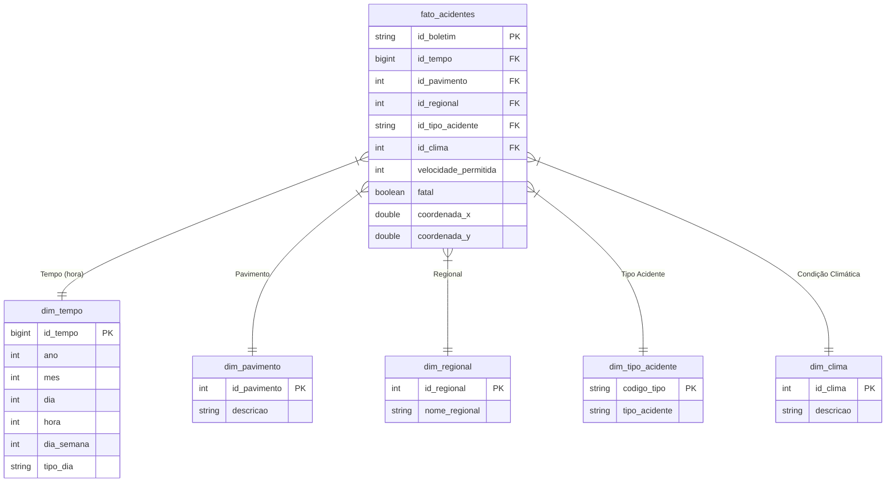

# Documentação dos Dados - Relação de ocorrências de acidentes de trânsito com vítima PBH 2021

## 1. Origem
- **Fonte Primária**: Dados Gov (https://dados.gov.br/dados/conjuntos-dados/relacao-de-ocorrencias-de-acidentes-de-transito-com-vitima)
- **Método de Obtenção**: Download direto manual
- **Arquivo Original**: `si_bol_2021.csv`

## 2. Licenciamento
```text
Licença: Open Data Commons Open Database License (ODbL) 
```

## 3. Dicionário de Campos (Bronze)

| Nome no CSV Original | Nome Transformado | Tipo | Descrição | Valores Exemplo |
|----------------------|-------------------|------|-----------|-----------------|
| NUMERO_BOLETIM | numero_boletim | string | Identificador único do boletim | "2021-008886628-002" |
| DATA HORA_BOLETIM | data_hora_boletim | timestamp | Data e hora do acidente | "20/02/2021 10:01" |
| DATA_INCLUSAO | data_inclusao | timestamp | Data e hora de registro no sistema | "20/02/2021 11:10" |
| TIPO_ACIDENTE | tipo_acidente | string | Código do tipo de acidente | "H01002" |
| DESC_TIPO_ACIDENTE | descricao_tipo_acidente | string | Descrição do tipo de acidente | "COLISÃO DE VEÍCULOS" |
| COD_TEMPO | codigo_tempo | integer | Código da condição climática | 1 |
| DESC_TEMPO | descricao_tempo | string | Descrição da condição climática | "BOM" |
| COD_PAVIMENTO | codigo_pavimento | integer | Código do tipo de pavimento | 1 |
| PAVIMENTO | pavimento | string | Descrição do tipo de pavimento | "ASFALTO" |
| COD_REGIONAL | codigo_regional | integer | Código da regional da PRF | 21 |
| DESC_REGIONAL | descricao_regional | string | Nome da regional da PRF | "NORDESTE" |
| ORIGEM_BOLETIM | origem_boletim | string | Fonte do registro do boletim | "POLICIA MILITAR" |
| LOCAL_SINALIZADO | local_sinalizado | string | Indica se o local era sinalizado | "SIM", "NÃO" |
| VELOCIDADE_PERMITIDA | velocidade_permitida | integer | Velocidade máxima permitida no local (km/h) | 60, 80, 0 (não informado) |
| COORDENADA_X | coordenada_x | double | Coordenada geográfica X | 0000605027.20 |
| COORDENADA_Y | coordenada_y | double | Coordenada geográfica Y | 0007797323.03 |
| HORA_INFORMADA | hora_informada | string | Indica se a hora foi informada corretamente | "SIM", "NÃO" |
| INDICADOR_FATALIDADE | indicador_fatalidade | string | Indica se houve vítima fatal | "SIM", "NÃO" |
| VALOR_UPS | valor_ups | integer | Valor da Unidade Primária de Serviço | 0 (não informado) |
| DESCRIÇÃO_UPS | descricao_ups | string | Descrição da UPS | "NÃO INFORMADO" |
| VALOR_UPS_ANTIGA | valor_ups_antiga | integer | Valor anterior da UPS | 0 (não informado) |
| DESCRIÇÃO_UPS_ANTIGA | descricao_ups_antiga | string | Descrição anterior da UPS | "NÃO INFORMADO" |

### Campos Derivados
| Nome do Campo | Tipo | Descrição | Fonte Original |
|---------------|------|-----------|----------------|
| data_boletim | date | Data extraída do timestamp | data_hora_boletim |
| hora_boletim | string | Hora extraída no formato HH:mm | data_hora_boletim |
| fatal | integer | Flag binária para acidentes fatais (1=Sim, 0=Não) | indicador_fatalidade |
| sinalizado | integer | Flag binária para locais sinalizados (1=Sim, 0=Não) | local_sinalizado |

## 4. Problemas e Tratamentos
- **Problema**: Datas em formato inconsistente
- **Solução**: Conversão com `to_timestamp()`
- **Problema**: Campos com encoding incorreto
- **Solução**: Ajuste com `ISO-8859-1`

## 5. Origem das Dimensões

| Dimensão         | Fonte Original                         | Transformação                         |
|------------------|----------------------------------------|----------------------------------------|
| `dim_tempo`      | `DATA_HORA_BOLETIM`                    | Extração de componentes de data (ano, mês, dia, hora, dia da semana) |
| `dim_pavimento`  | `COD_PAVIMENTO` + `PAVIMENTO`          | Mapeamento direto e padronização de categorias |
| `dim_regional`   | `COD_REGIONAL` + `DESC_REGIONAL`       | Mapeamento direto + Remoção de duplicatas |
| `dim_clima`      | `COD_TEMPO` + `DESC_TEMPO`               | Mapeamento direto + Remoção de duplicatas |
| `dim_tipo_acidente` | `TIPO_ACIDENTE` + `DESC_TIPO_ACIDENTE`      | Mapeamento direto + Remoção de duplicatas |


## 6. Modelagem


## 7. Dicionário de Campos (Ouro)

## Tabela Fato

### `fato_acidentes`

| Campo               | Tipo       | Chave   | Descrição                                               |
|--------------------|------------|---------|---------------------------------------------------------|
| `id_boletim`        | string     | PK      | Identificador único do boletim de ocorrência            |
| `id_tempo`          | bigint     | FK      | Chave para a dimensão temporal                          |
| `id_pavimento`      | int        | FK      | Chave para a dimensão de pavimento                      |
| `id_regional`       | int        | FK      | Chave para a dimensão regional                          |
| `id_tipo_acidente`  | string     | FK      | Chave para a dimensão de tipo de acidente               |
| `id_clima`          | int        | FK      | Chave para a dimensão de condições climáticas           |
| `velocidade_permitida` | int    | -       | Velocidade máxima permitida no local do acidente        |
| `fatal`             | boolean    | -       | Indica se houve vítima fatal                            |
| `coordenada_x`      | double     | -       | Coordenada geográfica X (longitude)                     |
| `coordenada_y`      | double     | -       | Coordenada geográfica Y (latitude)                      |

---

## Dimensões

### `dim_tempo`

| Campo         | Tipo     | Chave | Descrição                       |
|---------------|----------|-------|---------------------------------|
| `id_tempo`     | bigint   | PK    | Chave temporal                  |
| `ano`          | int      | -     | Ano do acidente                 |
| `mes`          | int      | -     | Mês do acidente                 |
| `dia`          | int      | -     | Dia do acidente                 |
| `hora`         | int      | -     | Hora do acidente                |
| `dia_semana`   | int      | -     | Dia da semana (1=Dom, 7=Sáb)    |
| `tipo_dia`     | string   | -     | Tipo de dia (ex: útil, final de semana, feriado) |

---

### `dim_pavimento`

| Campo           | Tipo     | Chave | Descrição                          |
|------------------|----------|-------|------------------------------------|
| `id_pavimento`    | int      | PK    | Código do tipo de pavimento        |
| `descricao`       | string   | -     | Descrição do tipo de pavimento     |

---

### `dim_regional`

| Campo            | Tipo     | Chave | Descrição                          |
|------------------|----------|-------|------------------------------------|
| `id_regional`     | int      | PK    | Código da regional                 |
| `nome_regional`   | string   | -     | Nome ou descrição da regional      |

---

### `dim_tipo_acidente`

| Campo            | Tipo     | Chave | Descrição                          |
|------------------|----------|-------|------------------------------------|
| `codigo_tipo`     | string   | PK    | Código do tipo de acidente         |
| `tipo_acidente`   | string   | -     | Descrição do tipo de acidente      |

---

### `dim_clima`

| Campo         | Tipo     | Chave | Descrição                                 |
|---------------|----------|-------|-------------------------------------------|
| `id_clima`     | int      | PK    | Código da condição climática              |
| `descricao`    | string   | -     | Descrição da condição climática (ex: chuva, seco, neblina) |

---
