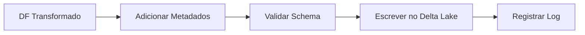

# MPV_Engenharia_de_Dados

## Fonte dos Dados

- **Dataset**: Boletins de Ocorrência de Acidentes de Trânsito com Vítimas
- **Fonte**: Polícia Rodoviária Federal (PRF)
- **Período**: Janeiro a Dezembro de 2021
- **Link de acesso**: [Portal de Dados Abertos da PRF](https://www.gov.br/prf/pt-br/acesso-a-informacao/dados-abertos/dados-abertos-acidentes)
- **Data de download**: 15/08/2023
- **Formato original**: CSV
- **Tamanho original**: ~350MB (compactado)

- ## Processo de Obtenção

1. Acesso ao portal de dados abertos da PRF
2. Download do arquivo `acidentes_2021.zip`
3. Extração do arquivo `si_bol_2021.csv`
4. Carga no Databricks via interface web

5. ## Termos de Uso

- **Licença**: Dados abertos conforme [Lei de Acesso à Informação](http://www.planalto.gov.br/ccivil_03/_ato2011-2014/2011/lei/l12527.htm)
- **Restrições**: Uso permitido para fins acadêmicos e de pesquisa
- **Atribuição**: Recomendada a citação da fonte

- ## Observações sobre os Dados

- Coluna `DATA_ALTERACAO_SMSA` estava completamente nula e foi removida
- Valores zero em `VELOCIDADE_PERMITIDA` representam dados não informados
- Caracteres especiais em algumas colunas de descrição

## Pipeline de Carga - Acidentes PRF 2021

### Fluxo de Carga


### Tabelas Carregadas
| Tabela | Formato | Modo | Registros |
|--------|---------|------|----------|
| `dim_tempo` | Delta | overwrite | `dim_tempo.count()` |
| `fato_acidentes` | Delta | append | `fato_acidentes.count()` |

### Metadados Incluídos
```json
{
  "pipeline_name": "carga_acidentes_prf",
  "source": "PRF",
  "ingestion_time": "2023-08-28T14:30:00Z"
}
```

### Check-list de Qualidade
- [x] Verificação de schema antes da carga
- [x] Registro de metadados
- [x] Log de execução

- ## Histórico de Versões

| Data       | Versão | Descrição                         |
|------------|--------|-----------------------------------|
| 15/03/2025 | 1.0    | Dataset original baixado da PRF   |
| 20/03/2025 | 1.1    | Remoção de colunas não utilizadas |
| 04/04/2025 | 2.0   | Novo schema de datas; Migração para Delta Lake |


