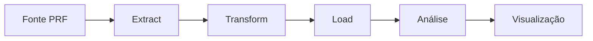

# Análise de Acidentes Rodoviários - PRF 2021

## 📌 Objetivo do Trabalho

Este projeto tem como objetivo **identificar padrões e fatores de risco** em acidentes rodoviários através da construção de um pipeline de dados na nuvem, utilizando a plataforma Databricks. Os resultados visam subsidiar políticas públicas de prevenção e segurança viária.

### Principais Questões de Pesquisa:
1. Qual a distribuição temporal dos acidentes (horário, dia da semana, meses)?
2. Quais são os tipos de acidentes mais frequentes e mais graves?
3. Como fatores como condições climáticas e tipo de pavimento influenciam os acidentes?
4. Existem trechos rodoviários com incidência significativamente maior de acidentes?

## 🛠️ Metodologia

### Fluxo de Dados

### Tecnologias Utilizadas
- **Plataforma**: Databricks (Community Edition)
- **Formato de Armazenamento**: Delta Lake
- **Linguagens**: PySpark, SQL
- **Visualização**: Matplotlib, Seaborn

## 📂 Estrutura do Projeto

### Principais Tabelas
| Nome | Tipo | Descrição |
|------|------|-----------|
| `acidentes_prf_2021_clean` | Delta | Dados tratados completos |
| `acidentes_2021` | View | Camada simplificada para análise |

### Arquivos Importantes
- `CATALOGO_DADOS.md`: Catálogo completo de campos
- `EVIDENCIAS.md`: Capturas dos campos visuais fora do notebook.
- `MPV engenharia de Dados.ipynb`: Notebook com todas as etapas e documentação.

## 📊 Resultados Esperados

- Identificação de **horários e trechos críticos**
- Análise de **padrões sazonais**
- Relação entre **condições ambientais** e gravidade dos acidentes
- Sugestões para **campanhas de prevenção** direcionadas

## 📝 Licença e Atribuição

- **Fonte dos Dados**: [Dados Gov - Relação de ocorrências de acidentes de trânsito com vítima]([https://dados.gov.br/dados/conjuntos-dados/relacao-de-ocorrencias-de-acidentes-de-transito-com-vitima](https://dados.gov.br/dados/conjuntos-dados/relacao-de-ocorrencias-de-acidentes-de-transito-com-vitima))
- **Licença**: [Dados Abertos](http://www.planalto.gov.br/ccivil_03/_ato2011-2014/2011/lei/l12527.htm)
- **Citação**: "Dados de acidentes rodoviários 2021 - PRF Brasil"

> ℹ️ Este projeto foi desenvolvido como trabalho acadêmico para a disciplina de Engenharia de Dados.
